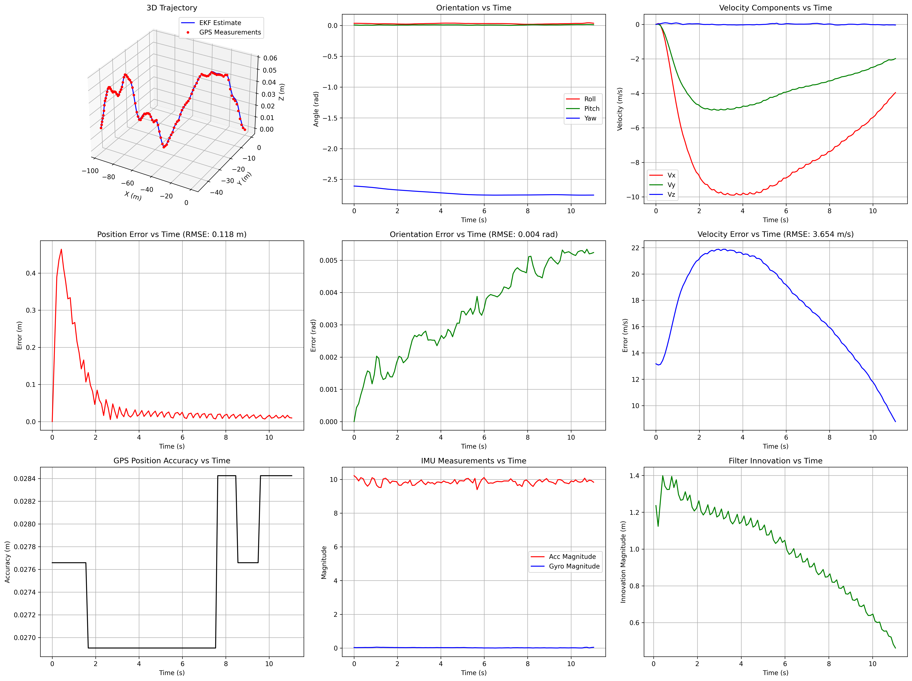
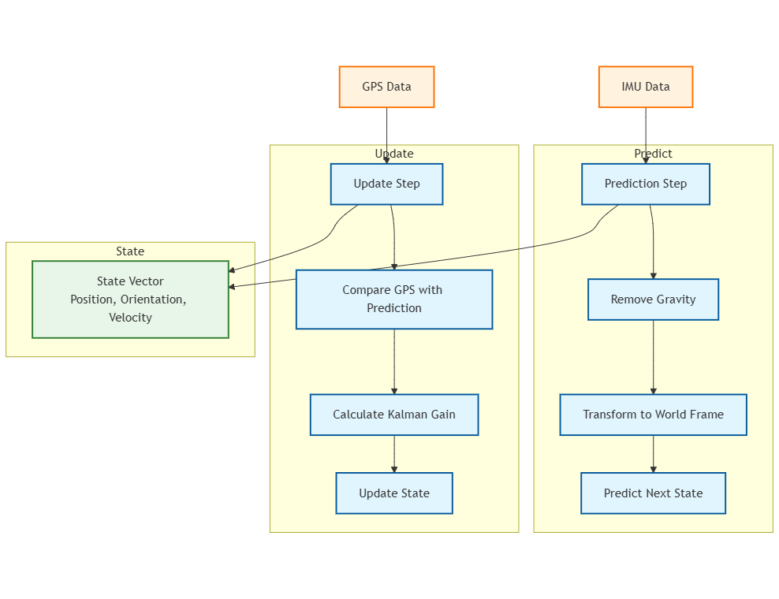
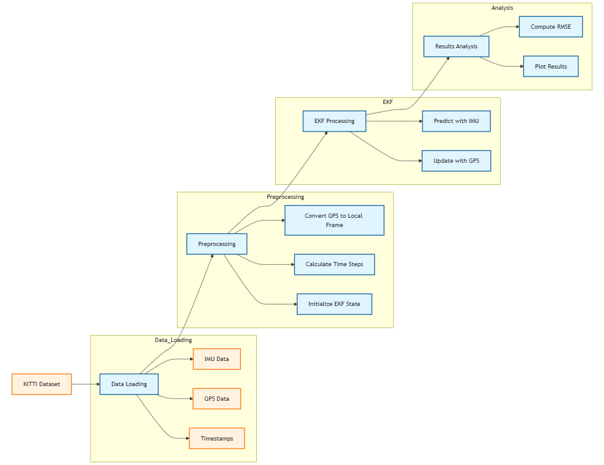

# 3D Extended Kalman Filter for GPS/IMU Sensor Fusion

## Overview
This project implements a complete 3D Extended Kalman Filter (EKF) for sensor fusion of GPS and IMU data using the KITTI dataset. The implementation provides accurate state estimation including position, orientation, and velocity by fusing data from multiple sensors.

## Features
- Full 3D state estimation (position, orientation, velocity)
- Real-time processing of IMU measurements (accelerometer and gyroscope)
- GPS position updates with accuracy-based measurement noise
- Adaptive process noise based on motion dynamics
- Comprehensive visualization and analysis tools
- Proper timestamp handling from dataset
- Frame transformation handling (body to world frame conversions)

## Results

### 1. Performance Visualization

The figure shows nine subplots demonstrating the performance of the EKF:
- Top row: 3D trajectory, orientation components, and velocity components
- Middle row: Position error, orientation error, and velocity error
- Bottom row: GPS accuracy, IMU measurements, and filter innovation

### 2. EKF Architecture
  
This diagram illustrates the core EKF components:
- State vector maintenance
- Prediction step using IMU data
- Update step using GPS measurements
- Frame transformations and gravity compensation

### 3. System Architecture

The complete system pipeline including:
- Data loading from KITTI dataset
- Preprocessing steps
- EKF processing
- Results analysis and visualization

## Performance Metrics
The implementation achieves the following RMSE values:
- Position: 0.118 meters
- Orientation: 0.004 radians
- Velocity: 3.654 m/s

## Dependencies
- Python 3.x
- NumPy
- Matplotlib
- datetime

## Installation
```bash
git clone https://github.com/yourusername/3d-ekf-sensor-fusion.git
cd 3d-ekf-sensor-fusion
pip install -r requirements.txt
```

## Usage
1. Download the KITTI dataset and update the DATA_PATH in main.py
2. Run the main script:
```bash
python main.py
```
3. Results will be saved as '3d_ekf_results.png'

## Code Structure
- `main.py`: Main script to run the EKF algorithm
- `OXTSData`: Class for parsing KITTI OXTS data format
- `ExtendedKalmanFilter3D`: Core EKF implementation
- Supporting functions:
  - `latlon_to_xyz`: Coordinate conversion
  - `plot_comprehensive_results`: Visualization
  - `compute_rmse_metrics`: Performance evaluation

## Implementation Details

### State Vector
The EKF maintains a 9-dimensional state vector:
- Position (x, y, z)
- Orientation (roll, pitch, yaw)
- Velocity (vx, vy, vz)

### Key Features
1. **GPS Integration**
   - Position measurements with accuracy metrics
   - Adaptive measurement noise covariance

2. **IMU Processing**
   - Gravity compensation
   - Proper frame transformations
   - Gyroscope integration

3. **Error Handling**
   - Robust timestamp parsing
   - GPS accuracy thresholding
   - Numerical stability considerations

## Contributing
Contributions are welcome! Please feel free to submit a Pull Request.

## License
This project is licensed under the MIT License - see the LICENSE file for details.

## Acknowledgments
- KITTI Dataset for providing the raw sensor data
- Extended Kalman Filter implementation based on probabilistic robotics principles